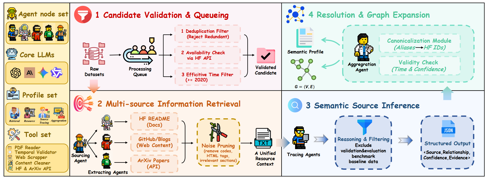
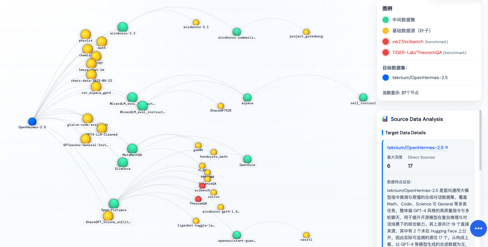

<div align="center">

# Tracing the Roots
### A Multi-Agent Framework for Uncovering Data Lineage in Post-Training LLMs

**Accepted by ACL 2026 Main Conference**

📄 [arXiv Paper](https://arxiv.org/abs/2604.10480)

🌐 [Web Demo](https://arena.opendatalab.org.cn/data-lineage/website/index.html)

<p>
  <a href="https://aclanthology.org/">
    
  </a>
  <a href="https://arena.opendatalab.org.cn/data-lineage/website/index.html">
    
  </a>
  
  
</p>

</div>

<p align="center">
  
</p>

This repository contains the official code for our paper on data lineage in post-training LLM datasets. It reconstructs lineage graphs by tracing reuse, refinement, merging, and derivation signals from Hugging Face dataset cards, GitHub repositories, blog posts, and papers.

> For the easiest experience, we recommend using the hosted **Web Demo** directly. It is already deployed and can be used immediately without local setup.  
> Use this repository when you want to **batch-process datasets**, **run the system locally**, or **customize the environment and workflow** yourself.

## Highlights

- Automatic lineage graph reconstruction for LLM post-training datasets
- Support for both text-only and multimodal tracing
- Incremental JSONL outputs with automatic skipping of already processed datasets
- An online web version for easier interactive tracing

## Example Visualization

The figure below shows a real lineage tracing example from the deployed web interface. It illustrates how the system visualizes upstream data sources, intermediate datasets, and benchmark-related nodes for a target dataset.

<p align="center">
  
</p>

## Quick Start for Local / Batch Usage ⚙️

`run.sh` uses `datasets.txt` by default for batch analysis. Put one Hugging Face dataset name per line in that file, then run the script. By default, `run.sh` starts in **text-only mode**. For multimodal datasets, add `--multimodal true`.

Set environment variables:

```bash
export OPENAI_BASE_URL="https://your-api-proxy.com/v1"
export OPENAI_API_KEY="your-api-key"
export HUGGINGFACE_API_TOKEN="your-hf-token"   # optional
```

Create the recommended conda environment:

```bash
conda env create -f environment.yml
conda activate data-lineage
```

Or install dependencies manually:

```bash
pip install langgraph langchain-openai langchain-core requests beautifulsoup4 arxiv PyMuPDF
```

Run from this directory:

```bash
bash run.sh
```

Examples:

```bash
bash run.sh datasets.txt
bash run.sh datasets.txt --max-depth 3
bash run.sh datasets.txt --multimodal true
bash run.sh datasets.txt --output-dir output
```

You can also run it directly from the parent directory:

```bash
cd ..
python -m data_lineage data_lineage/datasets.txt --output-dir output
```

## Input

The input file should contain one Hugging Face dataset name per line. For batch runs, you can edit `datasets.txt` directly, since `bash run.sh` uses it by default.

```text
openai/gsm8k
HuggingFaceH4/ultrachat_200k
AI-MO/NuminaMath-CoT
```

## Output

Results are stored under `output/`:

- `output/multimodal/graph.jsonl`
- `output/multimodal/data.jsonl`
- `output/text-only_modality/graph.jsonl`
- `output/text-only_modality/data.jsonl`
- `output/data_lineage.log`

Notes:

- `graph.jsonl` stores lineage edges
- `data.jsonl` stores dataset metadata
- `data_lineage.log` is overwritten on each run
- Existing results are reloaded automatically unless `--no-load-existing` is used
- `run.sh` writes to `output/text-only_modality/` by default; use `--multimodal true` to write to `output/multimodal/`

## Main Files

```text
agents/              multi-agent tracing components
workflow.py          main lineage workflow
main.py              CLI entry
models.py            shared data structures
run.sh               convenience launcher
```

## More Options

```bash
bash run.sh --help
```

## Citation

If you use this repository, please cite:

```bibtex
@misc{li2026tracingrootsmultiagentframework,
      title={Tracing the Roots: A Multi-Agent Framework for Uncovering Data Lineage in Post-Training LLMs}, 
      author={Yu Li and Xiaoran Shang and Qizhi Pei and Yun Zhu and Xin Gao and Honglin Lin and Zhanping Zhong and Zhuoshi Pan and Zheng Liu and Xiaoyang Wang and Conghui He and Dahua Lin and Feng Zhao and Lijun Wu},
      year={2026},
      eprint={2604.10480},
      archivePrefix={arXiv},
      primaryClass={cs.AI},
      url={https://arxiv.org/abs/2604.10480}, 
}
```
